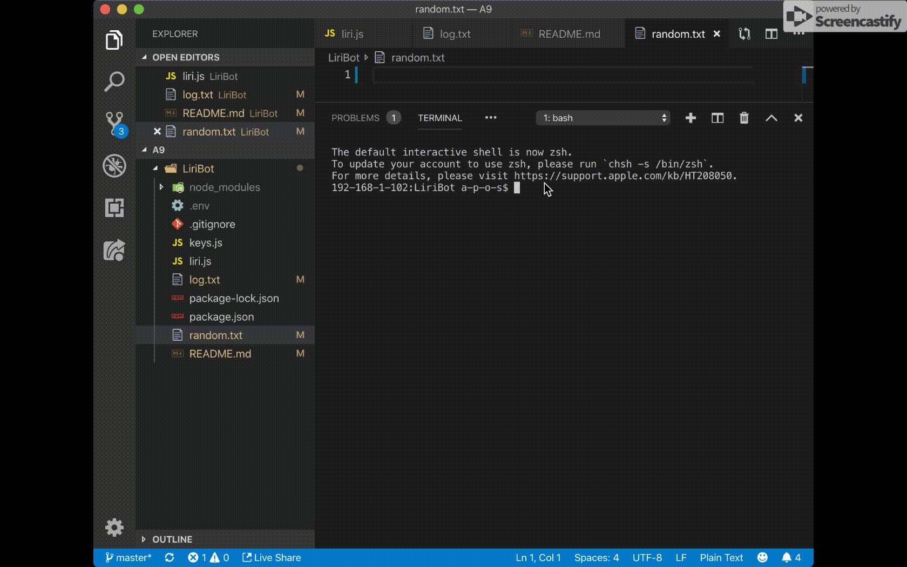
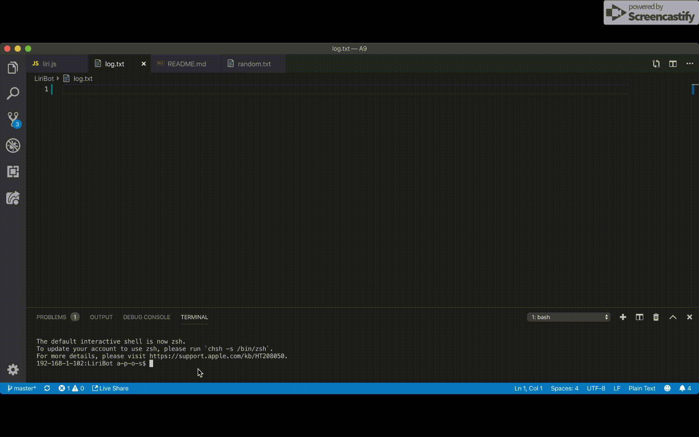
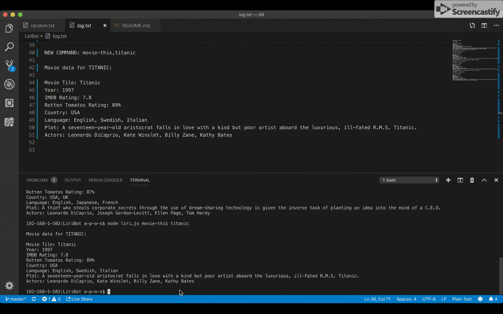
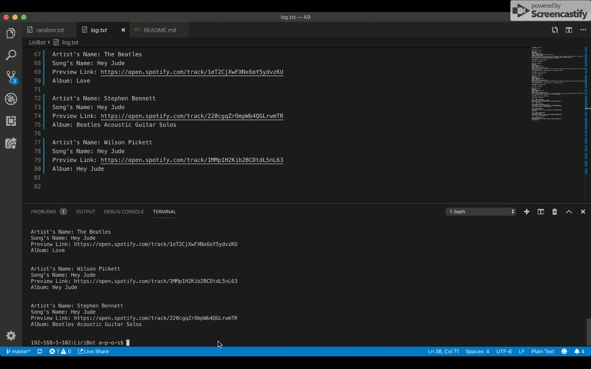
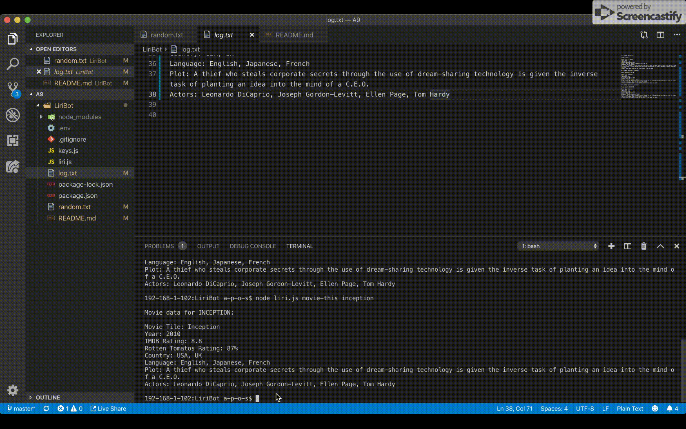
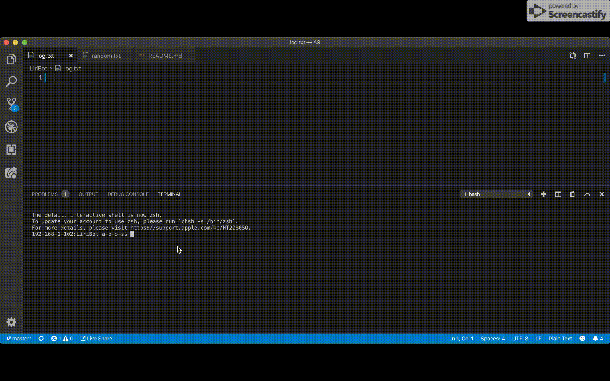

# LiriBot

## What this app is all about

This is an application that uses Node.js as a means to retrieve and display information for the purpose of facilitating user in getting up-to-date and reliable data with respect to their chosen artists, songs and movies. With this tool a user can, by simply inputting a specific `COMMAND` as well as `CONTENT`, get structured data about:

1. Upcoming concert events for an artist: (Listed data)

- Name of the venue
- Location of the venue
- Date of the event (in `MM/DD/YYYY` format)

2. Spotify data for a given song name:

- Artist's name
- Song's name
- A preview link of the song from Spotify
- The album that the song is from

3. OMDB data for a specific movie:

- Title of the movie.
- Year the movie came out.
- IMDB Rating of the movie.
- Rotten Tomatoes Rating of the movie.
- Country where the movie was produced.
- Language of the movie.
- Plot of the movie.
- Actors in the movie.

## Overview

The functionality of this app are built upon the use of npm packages which are:

1. DotEnv
   It is used to store environment variables which will then be used in global process.env object in node. These are values that are meant to be specific to the computer that node is running on, and since we are gitignoring this file, they won't be pushed to github — keeping our API key information private.

2. Axios
   It is used to grab data from the OMDB API and the Bands In Town API

3. Moment
   It is used to format date data retrieved from Bands In Town API

4. fs
   It is used to _write_ user input data in a `random.txt` file which will then be _read_ to make corresponding data request. It is also responsible for logging ( _append_ ) all user input and data output into a separate file `log.txt` for reference and archiving purpose.

5. Node-Spotify-API
   It is installed as an npm package and used for requesting and displaying data about user typed song.

## User Guide

User communicate with LiriBot via two methods: Node.js terminal command or directly change text inside ramdom.txt file. Here is a complete instruction of how to use this app:

node liri.js COMMAND CONTENT

- In Node.js Liribot root terminal user run the app by typing input in the format of "node liri.js _COMMAND_ _CONTENT_".

COMMAND will be one of the following:

- concert-this
- spotify-this-song
- movie-this
- do-what-it-says

CONTENT input will be either a song, a movie, a singer or left blank depends on the COMMAND made.

- After user typed in codes to run LiriBot, LiriBot will

1.  Write codes into the `random.txt` file

```console
if (input1 != "do-what-it-says") {
  fs.writeFile("./random.txt", userInput, err => {
    if (err) {
      console.error(err);
      return;
    }
  });
}
```



2.  Read what is in random.txt file and then translate it into constructed data request. In another word, random.txt file acts as the controller of the app

3.  Display data, with the use of `console.log`, in terminal in the constructed format so that user can clearly see all key relevant information

4.  Store each user input as well as retrieved data in the `log.txt` file for user's future reference purpose (previous search result will NOT be overwritten)

5.  Every time user runs LiriBot with new COMMAND and CONTENT, data in the random.txt file update accordingly

6.  The same operation cycle will be performed as what is demonstrated above

**LiriBot operating secenario examples:**

- Node.js terminal

See how user input changes the content in random.txt file

- COMMAND: concert-this CONTENT: user specified artist name



- COMMAND: spotify-this-song CONTENT: user specified song name



- COMMAND: spotify-this-song CONTENT: empty



- COMMAND: movie-this CONTENT: user specified movie name



- COMMAND: movie-this CONTENT: empty



- Directly process what is in random.txt file with COMMAND: do-what-it-says in Node.js terminal


